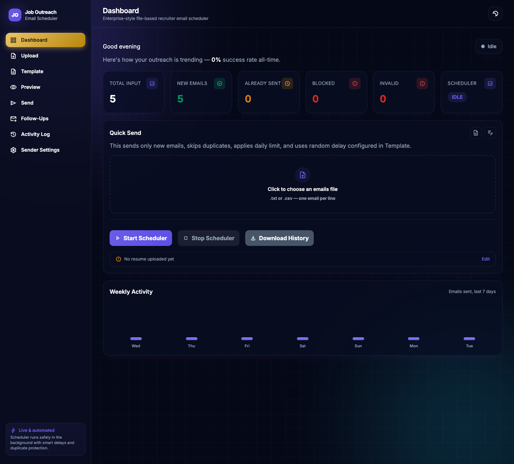
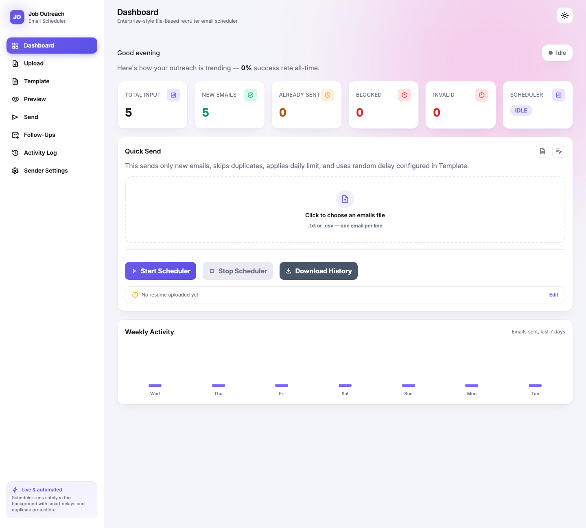
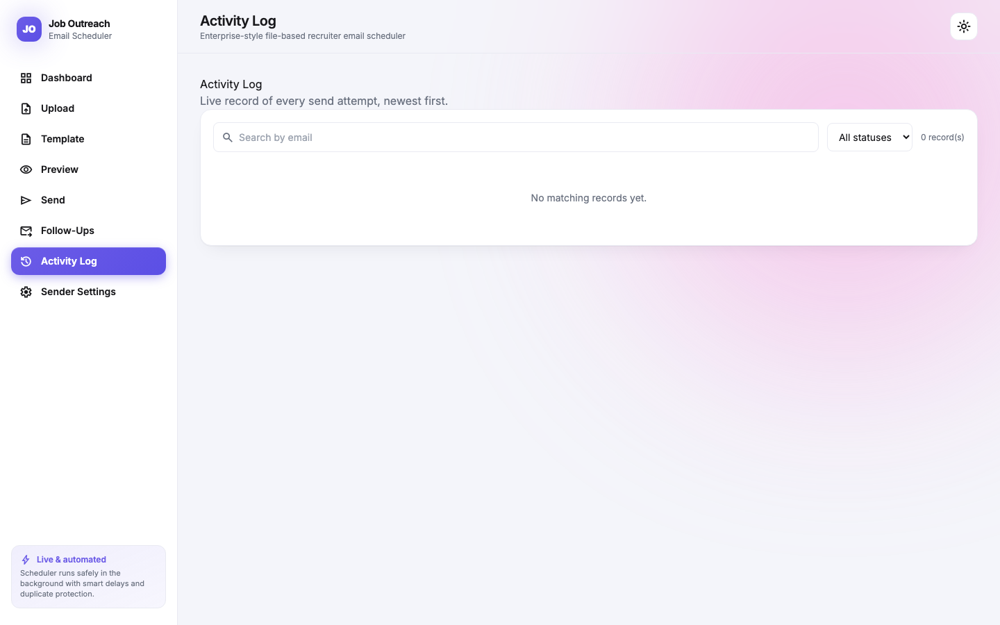
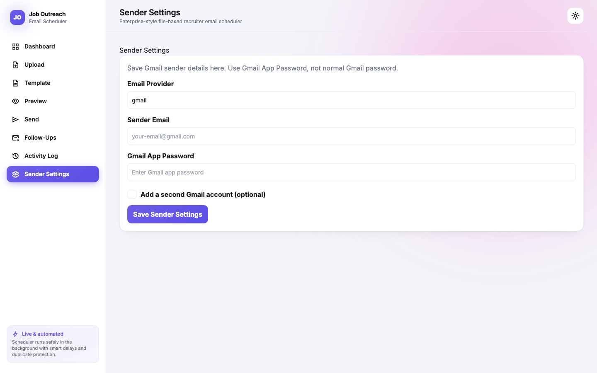

# Job Outreach Email Scheduler Framework

Enterprise-style file-based framework for recruiter outreach emails, with a premium light/dark dashboard.

<p>
  
  
</p>

## What this framework does

- Upload extracted recruiter/company emails as a `.txt` or `.csv` file — parsing pulls the email out of each line automatically, so quoted CSV columns and a header row (e.g. `email,domain`) never get misclassified as invalid.
- Keep old sent emails in `sent_emails.json` to avoid duplicate sending.
- Manage subject/body/safety settings from the UI.
- Upload a resume PDF, attached to every initial outreach email.
- Preview new, duplicate, blocked, and invalid emails before sending.
- Send one email at a time using a random delay and a daily limit.
- Optionally rotate between **two Gmail sender accounts**, picked at random per email, to spread volume across inboxes.
- Detect non-retryable failures (e.g. missing sender credentials) and stop the run immediately instead of burning through the whole batch with repeated failures.
- Track and send follow-up emails, with automatic reply detection.
- Save email history in Excel, and browse it live in an in-app Activity Log.
- Live dashboard with real-time scheduler status, animated stats, and a weekly send-activity chart.

## What this framework does not include

This project does not include LinkedIn scraping, LinkedIn DOM automation, or any bypass logic for Gmail/LinkedIn controls. Input emails must be provided by the user through the upload screen.

## Dashboard UI

<p>
  
  
</p>

- **Light and dark themes** (dark by default), toggled from the icon in the top-right corner. Switching plays a liquid circular reveal animation expanding from the toggle button (View Transitions API, with a graceful instant-swap fallback).
- **Dark mode**: glassmorphism panels with backdrop blur, ambient purple/cyan glow blobs, and a subtle grid pattern. Sidebar nav text is white, with the active page highlighted as a full gold gradient pill.
- **Light mode**: a clean Vercel-style look — soft blurred blue/pink mesh gradient in the background, crisp white cards, violet accent.
- Built with Tailwind CSS (loaded via CDN, no build-step config needed) and Material Symbols icons throughout.
- **Quick Send panel on the Dashboard**: drag-and-drop-style file picker for the emails list, Start/Stop Scheduler, Download History, and a resume status/edit shortcut — the whole daily workflow without leaving the dashboard. After an upload it immediately shows how many emails are new vs. already sent.
- Live-updating dashboard: pulsing scheduler status badge (including a dedicated red **Error** state), animated count-up stat cards, an animated send-progress bar while the scheduler is running, and a weekly activity bar chart built from real send history.
- **Activity Log** page: search by email, filter by status, paginate through every send attempt, with popup error notifications if the log fails to load.
- Toast popup notifications for scheduler start/stop/errors, and automatically when a run finishes or fails on its own (not just on button clicks).
- Custom premium checkboxes and file dropzones shared across the Upload and Dashboard pages.
- Fully responsive: the sidebar collapses into a horizontal scrollable nav bar on mobile.

## Backend setup

```bash
cd backend
cp .env.example .env
npm install
npm run dev
```

Update `.env`:

```env
EMAIL_USER=your-job-mail@gmail.com
EMAIL_PASS=your-gmail-app-password
DEFAULT_DRY_RUN=true
```

Alternatively, configure the sender account(s) from the Sender Settings page in the UI — including an optional second Gmail account for random dual-sending — instead of (or in addition to) the `.env` values.

## Frontend setup

```bash
cd frontend
npm install
npm run dev
```

## Daily usage

1. Upload `extracted_emails.txt` (or a `.csv`) from the Dashboard or Upload page.
2. Upload a resume PDF.
3. Edit the email template and safety settings.
4. Preview emails.
5. Start the scheduler and watch live progress on the Dashboard.
6. Check the Activity Log or download the Excel history.

## Recommended safety settings for 100/day

- Daily limit: 100
- Min delay: 180 seconds
- Max delay: 420 seconds
- Stop after continuous failures: 3
- Stop after total failures: 8
- Dry run first: true

## Notes

No delivery system can guarantee inbox placement. This framework uses safer sending patterns: duplicate checks, daily limits, random delay, failure stop, and dry-run mode.

Local data files under `backend/src/data/` (uploaded emails, sent history, sender credentials) are gitignored and never committed — screenshots in this README use placeholder sample data only.
